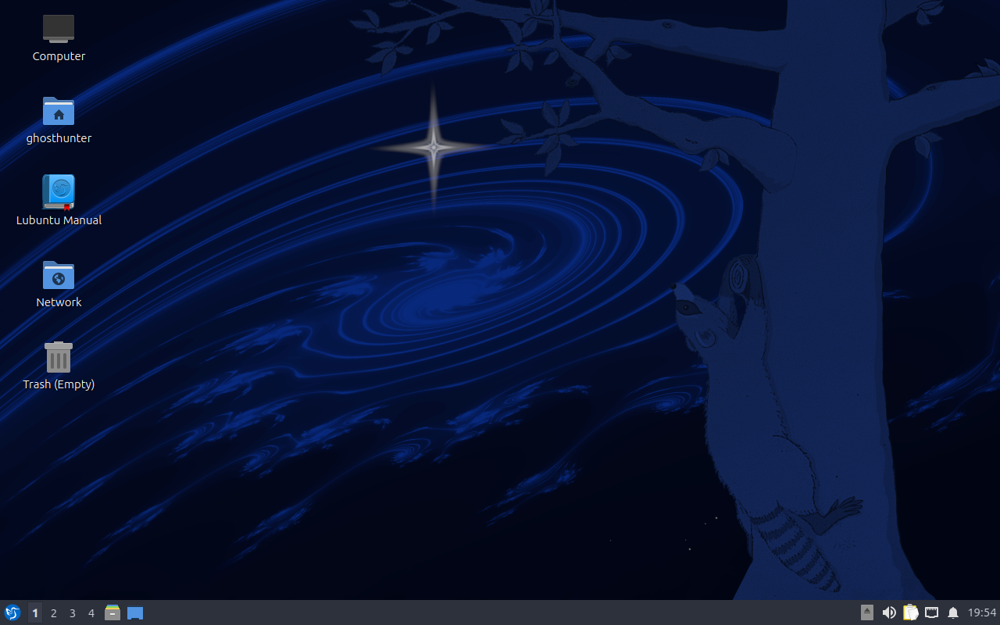
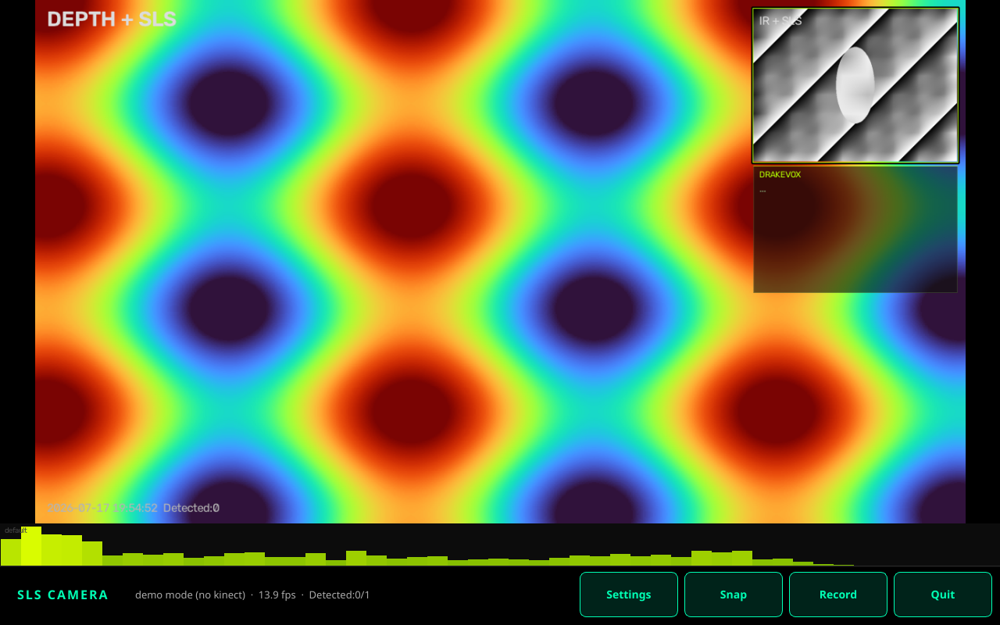

# Field app install (dev packaging)

**Stay in dev:** this documents how to wire a **git checkout** of the SLS Qt app on a Linux host (OptiPlex, tablet prototype, etc.). It is **not** a flashable tablet firmware image.

**Firmware team:** start here → **[FOR-FIRMWARE-TEAM.md](FOR-FIRMWARE-TEAM.md)** (offline apt golden rules, commands, exit codes, smoke checklist).

Target product path (later): **tablets** with Kinect, then sensor inputs and **stable external power** so SLS runs as a field appliance. Those steps are backlog — see below and [docs/TODO.md](../../../docs/TODO.md).

## Scripts

| Script | Role |
|--------|------|
| [`../scripts/install-field-app.sh`](../scripts/install-field-app.sh) | Install user launcher + optional login autostart |
| [`../scripts/uninstall-field-app.sh`](../scripts/uninstall-field-app.sh) | Remove what install added (+ optional safe apt purge) |
| [`../scripts/install-apt-deps.sh`](../scripts/install-apt-deps.sh) | Host apt **seeds** online or from offline deb cache (#2/#3) |
| [`../scripts/fix-kinect-access.sh`](../scripts/fix-kinect-access.sh) | gspca unload + freenect udev (sudo) |
| [`../scripts/install-freenect.sh`](../scripts/install-freenect.sh) | Host freenect packages (legacy one-shot) |
| [`../scripts/check-kinect.sh`](../scripts/check-kinect.sh) | Quick USB / freenect health |
| [`../packages/apt-packages.txt`](../packages/apt-packages.txt) | Seed package list (keep aligned with firmware) |

### Install (typical dev machine)

```bash
# from repo root
./software/linux/scripts/install-field-app.sh

# launcher only (no login autostart) — good for daily dev
./software/linux/scripts/install-field-app.sh --no-autostart

# fuller host prep (sudo) — uses install-apt-deps.sh
./software/linux/scripts/install-field-app.sh \
  --with-apt-deps \
  --with-kinect-access
```

### Offline / cache-based apt (issue #2)

Seed-only offline packs fail (missing hard deps). The **correct** path is what the firmware team proved:

1. Fetch **recursive** hard Depends into a deb folder (`sls-camera-firmware/scripts/10-fetch-offline.sh` with `FETCH_DEPS=1` → ~360 debs).
2. **Never** `dpkg -i vendor/debs/*.deb` on a full desktop (OR-alternative conflicts — #3).
3. Copy debs into `/var/cache/apt/archives` and install **seeds only**:
   `apt-get install --no-install-recommends --no-download <seeds>`

This repo’s installer does that:

```bash
# Auto-detects sibling ~/sls-camera-firmware/vendor/debs when present
./software/linux/scripts/install-field-app.sh --with-apt-deps

# Explicit cache
./software/linux/scripts/install-field-app.sh --with-apt-deps \
  --deb-cache /path/to/vendor/debs

# Strict offline (no network fallback)
SLS_OFFLINE=1 ./software/linux/scripts/install-field-app.sh --with-apt-deps \
  --deb-cache /path/to/vendor/debs

# Or call the helper alone
./software/linux/scripts/install-apt-deps.sh --print-seeds
./software/linux/scripts/install-apt-deps.sh --deb-cache ~/sls-camera-firmware/vendor/debs
```

Env knobs: `SLS_DEB_CACHE`, `SLS_OFFLINE=1`, `SLS_APT_YES=1`.

Cross-link: firmware [OFFLINE-MIRROR.md](https://github.com/tmdrake/sls-camera-firmware/blob/main/docs/OFFLINE-MIRROR.md).

### What install places on disk

| Path | Purpose |
|------|---------|
| `~/.local/bin/sls-camera` | Wrapper → `software/linux/viewer/run.sh` in **this** clone |
| `~/.local/share/applications/sls-camera.desktop` | App menu entry |
| `~/.config/autostart/sls-camera.desktop` | Autostart after graphical login (optional) |
| `~/.local/share/sls-camera/install-manifest.txt` | Paths for uninstall |

Does **not** copy the tree system-wide. Moving/renaming the repo breaks the wrapper until you re-run install.

### Uninstall

```bash
./software/linux/scripts/uninstall-field-app.sh
# stop autostart only, keep menu launcher:
./software/linux/scripts/uninstall-field-app.sh --keep-launcher
```

Leaves: git repo, `viewer/.venv`, captures, gspca blacklist (if you used `--with-kinect-access`).  
Apt packages stay by default; optional safe purge:

```bash
./software/linux/scripts/uninstall-field-app.sh --purge-apt-deps
# only freenect / libportaudio2 / espeak-ng / v4l-utils (see packages/apt-purge-safe.txt)
# never purges python3, ca-certificates, libgl1, …
```

## Dependencies & version conflicts (issue tracking)

Report and resolve **apt/Python missing deps and package version conflicts** on the **sls-camera** issue tracker (not only in the firmware repo):

| Issue | Scope | Status in this tree |
|-------|--------|---------------------|
| [#2](https://github.com/tmdrake/sls-camera/issues/2) | Offline recursive deps, cache-based install | **install-apt-deps.sh** + `--with-apt-deps` / `--deb-cache` / `SLS_OFFLINE` |
| [#3](https://github.com/tmdrake/sls-camera/issues/3) | OR-alternatives, python downgrades, new conflicts | Mitigated by **never blanket dpkg -i**; apt resolves alternatives. New conflicts → comment on #3 |

### Rules firmware + app installers must keep

| Do | Don’t |
|----|--------|
| Install **seeds** from `packages/apt-packages.txt` | Seed-only offline pack without transitive debs |
| Copy recursive debs → `/var/cache/apt/archives` + `apt-get install --no-download` | `dpkg -i vendor/debs/*.deb` (hits both sides of OR deps) |
| Drop `libav*-extra*` / `libjack0` from fetch packs | Assume `file://` offline-only apt source (downgrade traps) |
| `pip install --no-index --find-links=…` when wheels vendored | `pip install --upgrade pip` from PyPI offline |

**Display manager:** Lubuntu 26.04 uses **SDDM**, not LightDM — appliance autologin must target SDDM (firmware image work).

**Captures path:** app honors `SLS_CAPTURES_DIR`; install wrapper also exports it when `/data/sls-captures` exists.

Sibling firmware: [OFFLINE-MIRROR.md](https://github.com/tmdrake/sls-camera-firmware/blob/main/docs/OFFLINE-MIRROR.md).

## Screenshots (appliance VM smoke test)

Phase 1 packaging was proven on a **Lubuntu 26.04** KVM guest with the sibling firmware installer; demo mode needs no Kinect.

| Desktop | SLS Camera (`--demo`) |
|---------|------------------------|
|  |  |

See [`images/README.md`](images/README.md) for capture notes and a second HUD frame. Firmware first-boot notes: sibling repo `sls-camera-firmware` → `docs/FIRST-BOOT.md`.

## Quit vs power-off (app vs appliance)

Dev default: **Quit returns to the desktop** (no host shutdown).

| Knob | Effect |
|------|--------|
| Settings **Power off on Quit** | Persisted in `viewer/user_settings.json` |
| Env `SLS_QUIT_ACTION=shutdown` | Forces power-off mode for this process (appliance) |
| Env `SLS_QUIT_ACTION=exit` | Forces exit-only mode for this process |

On confirmed power-off Quit the app stops capture cleanly, exits with code **10**, and best-effort runs host `poweroff` (passwordless `sudo` paths used by appliance sudoers when present). Exit codes:

| Code | Meaning |
|------|---------|
| `0` | Clean quit (desktop / shell) |
| `10` | Operator requested host power-off |
| `11` | Relaunch app (reserved for kiosk) |

Firmware launcher (`sls-camera-firmware` → `/usr/local/bin/sls-camera`) already understands these codes (`SLS_ON_QUIT=app`). See viewer [README § Quit](../viewer/README.md#quit) and issue [#4](https://github.com/tmdrake/sls-camera/issues/4).

## Still manual / separate

| Item | Notes |
|------|--------|
| **Kinect USB Audio** | `sudo apt install kinect-audio-setup` (+ MSI hash recovery in [UBUNTU-SETUP.md](UBUNTU-SETUP.md)) |
| **First run** | `run.sh` builds venv, downloads MediaPipe model (network once) |
| **DISPLAY** | Needs a logged-in desktop session for Qt |
| **Passwordless poweroff** | Appliance: sudoers for `poweroff` / `systemctl poweroff` (firmware); without it, exit `10` still lets the launcher power off |

## Dev vs tablet firmware (roadmap)

```text
Now (dev)
  git clone → install-field-app.sh → sls-camera / optional autostart
       │
Later (tablet appliance)
  clean desktop chrome (no stock Lubuntu clutter)
  firmware / image package install
  sensors (Arduino-class) + DrakeVox triggers
  power management: stable SLS on external power + tablet battery policy
```

### TODO (tracked in project backlog)

1. **Clean the desktop before a firmware package install** — strip or replace default session chrome so the tablet boots to a field UI, not a full desktop playground.
2. **Tablet-oriented image or package** — repeatable install for field units (beyond user-local scripts).
3. **Sensor inputs** — MCU bridge into the same app.
4. **Power management** — keep Kinect + app stable on external supply; define tablet sleep/suspend policy so investigations are not interrupted.

## Related

- App: [../viewer/README.md](../viewer/README.md)
- Product vision: [../../../docs/PRODUCT-VISION.md](../../../docs/PRODUCT-VISION.md)
- Ubuntu / freenect: [UBUNTU-SETUP.md](UBUNTU-SETUP.md)

## Tablet firmware (separate repo)

Dev install scripts above are for **developer hosts**. For a flashable / blow-and-go tablet image:

- **Repo:** `sls-camera-firmware` (sibling of this project: `~/sls-camera-firmware`)
- **Goals:** no-login kiosk, offline freenect + Python + MediaPipe cache, autostart SLS app, writable `/data/sls-captures`
- **Docs:** `sls-camera-firmware/README.md`, `docs/BUILD.md`, `docs/OFFLINE-MIRROR.md`
- **Phase 1:** `sudo ./scripts/install-appliance.sh` on a blank Ubuntu/Lubuntu tablet
- **Phase 2:** bootable ISO (not finished yet)

Do not put Microsoft Kinect UAC firmware in public firmware trees.

