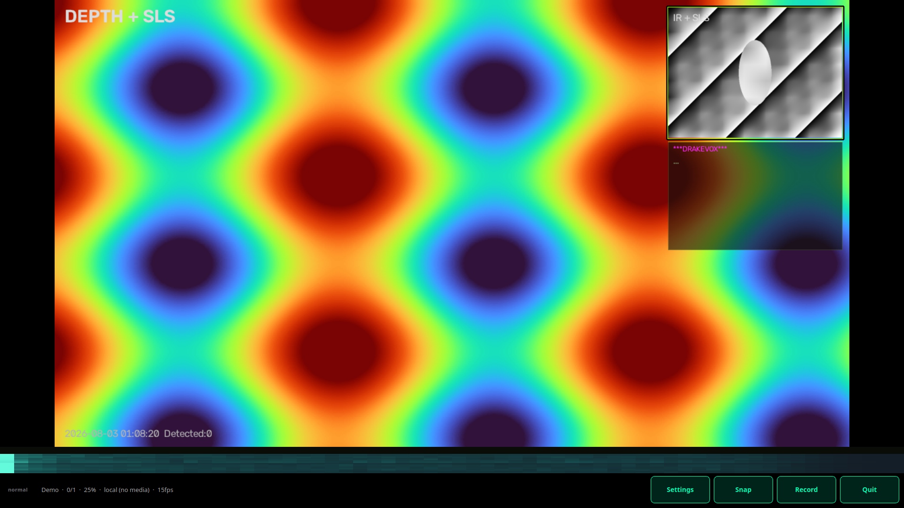

# Screenshots (Linux field UI)

Used by the [viewer README](../../viewer/README.md) and firmware docs. Same filenames are mirrored under `sls-camera-firmware/docs/images/` when updated.

## Current UI (2026-08, app `main`)

| File | Description |
|------|-------------|
| [30-demo-normal-main.png](30-demo-normal-main.png) | Fullscreen **`--demo`**, **normal** mode (15 fps), status bar `normal · Demo · …`, spectrum, DrakeVox under IR PiP |
| [31-demo-normal-settings.png](31-demo-normal-settings.png) | Same demo session (companion frame) |



## Historical (Phase 1 appliance VM)

| File | Description |
|------|-------------|
| [01-guest-desktop.png](01-guest-desktop.png) | Clean Lubuntu desktop (LXQt) before launching the app |
| [02-sls-demo-app.png](02-sls-demo-app.png) | Earlier fullscreen SLS Camera **`--demo`** |
| [03-sls-demo-hud.png](03-sls-demo-hud.png) | Earlier demo HUD still |

## How these were taken

```bash
# Desktop / lab (this machine)
DISPLAY=:0 ./software/linux/viewer/run.sh --demo --show-fps
# then: scrot software/linux/docs/images/30-demo-normal-main.png

# host: console dump of the KVM guest
virsh -c qemu:///system screenshot sls-appliance-phase1 docs/images/out.png
```

See also: [FIELD-INSTALL.md](../FIELD-INSTALL.md), [FOR-FIRMWARE-TEAM.md](../FOR-FIRMWARE-TEAM.md), firmware [FIRST-BOOT.md](https://github.com/tmdrake/sls-camera-firmware/blob/main/docs/FIRST-BOOT.md).
